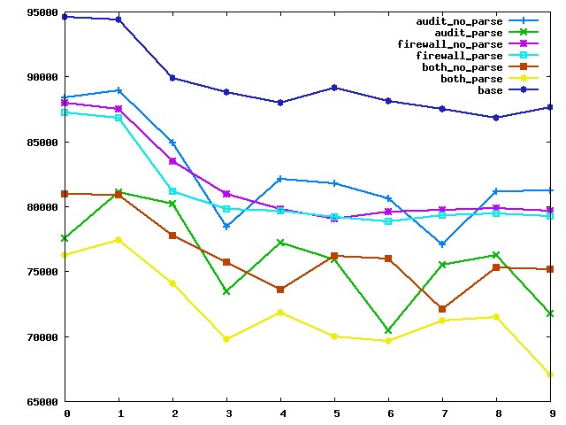
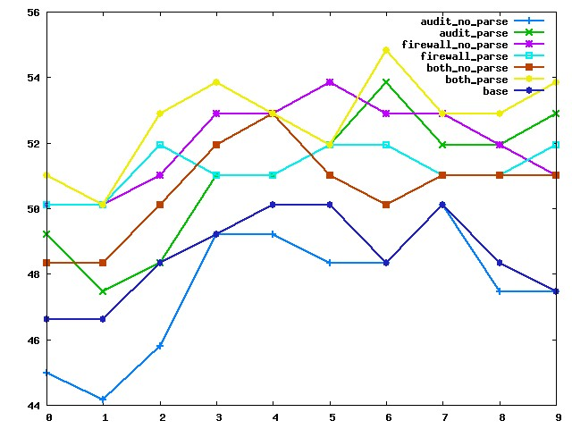

**MySQL-Audit**

* The code is a copy of MySQL 5.7. Our goals: To maintain our own branch, which is suitable for. buissiness mode and technology architect.
At first, we have some requirements for sql access auditing. So that, We not only port the percona audit_log plugin in and also port Mcafee SQL audit
plugin in. We find out that both of them can not match our gaols, but,for example, they all have fixed audit log file name, and the log file size is also
fixed size. When MySQL runs in a heavy overload enviroment, the size of log file maybe exceed over GBs. A large GB log file is hard to open, to find 
somethings in such haystack. Therefore, we make decisions to build our own branch to provide some maintainable features. And, in future, We will optimize
the core code of MySQL. That's why we build up this repository.

* How to install MySQL-Audit from source. 
(1) At first, You **SHOULD** and **MUST** have a copy of MySQL-Audit.
(2) Then you should have a place, which we run cmake in. After that we can run cmake with proper configurations. 
For example, we touch a new fold: build_cmk at source code directory level. then change the working directory to build_cmk, and run the cmake command as following:

cmake -DCMAKE_INSTALL_PREFIX=../bin   -DMYSQL_DATADIR=../bin/data  -DSYSCONFDIR=../bin/etc   -DWITH_MYISAM_STORAGE_ENGINE=1  -DWITH_ARCHIVE_STORAGE_ENGINE=1  -DWITH_BLACKHOLE_STORAGE_ENGINE=1 -DWITH_INNOBASE_STORAGE_ENGINE=1  -DWITH_MEMORY_STORAGE_ENGINE=1  -DWITH_READLINE=1  -DMYSQL_TCP_PORT=3306 -DENABLED_LOCAL_INFILE=1  -DWITH_PARTITION_STORAGE_ENGINE=1  -DEXTRA_CHARSETS=all  -DDEFAULT_CHARSET=utf8  -DDEFAULT_COLLATION=utf8_general_ci  -DWITH_BOOST=../../boost_1_59_0/ -DDOWNLOAD_BOOST=0  -DCMAKE_BUILD_TYPE=Debug ..

(3) After the configuration done without errors occur. the "**make**" and "**make install**" should be run.
For example:

make && make install

(4)After the MySQL-Audit compilation and installation. we should compile and install another sql audit plugin--SQL Audit Plugin.The guideline is same as 
REMAD of MySQL-Audit.

-------------------------------------------------------------------------------------------------------------------------------------------------------------

Before install the audit-sql plugin, you need to install mysql properly. After correct installation, the some libs will be used in next installation.

* How to build the **audit_sql** plugin:

(0) At first, entering into the source code directory of audit_sql(in ${MySQL-Audit-DIR/plugin/audit_sql}), and runing the bootstrap.sh script. If it has not the permission to excute, then run 'chmod +x bootstrap.sh'. 

./bootstrap.sh

(1) Then, set some environment variables for gcc. 

CXX='gcc -static-libgcc' CC='gcc -static-libgcc'

(2) To configure it. run the following scripts. Note: the prefix: --with-mysql and --with-mysql-installdir is mandatory. --with-mysql-installdir and --with-mysql-plugindir are used for next compilation step. --with-mysql-plugindir indicates where the plugin will be installed, and --with-mysql-installdir indicates where the mysql executable files are installed. If you want to build it with debug symbols, you need to set --enable-debuginfo on. Turning --enable-debuginfo off, it was built without debug symbols.

./configure --with-mysql=/the_mysql_source_directory --with-mysql-libservices=/the_mysql_source_directory_install_dir/lib/libmysqlservices.a --with-mysql-installdir=/the_mysql_source_directory_install_dir --with-mysql-plugindir=/the_mysql_source_directory_install_dir/lib/plugin --eanble-debuginfo=[yes/no]

Taken mine as an instance. on my computer, I will run the command as following:

CXX='gcc -static-libgcc' CC='gcc -static-libgcc' ./configure --with-mysql=/home/homli/work/mysql-server/ --with-mysql-libservices=/home/homli/work/mysql-server/build_cmk/libservices/libmysqlservices.a --with-mysql-plugindir=/home/homli/work/mysql-server/build_cmk/bin/lib/plugin --with-mysql-installdir=/home/homli/work/mysql-server/build_cmk/ --enable-debuginfo=yes

(3) Then run the following script to make and install the audit plugin.

make && make install

(4) If you meet some errors, it's okay and be patient to fix it on you own. 

(5) At last, Maybe enjoy the DIY.

-----------------------------------------------------------------------------------------------------
All about the McAfee Audit Plugin.*

**(1) DESCRIPTION.**

   This plugin is using a technique, which we call "Hot Patch". By using GDB as the tool to detect the fileds of MysQL "THD". 
As we known, the data structure of THD is the most important item in MySQL. It represents THREAD, which was created at a connection built up. So, the GDB use 'HOT PATCH' to get offsets of all fileds in a THD.

   Before we install the plugin, we MUST get the offset values.  By using 'offset-extract.sh', the offsets will be retrived from an instance of mysqld. There is a piece of infomation shuld us known that these offsets are dependant on VERSION of mysql. The different version has different THD definition. Therefore, the offsets of very filed in HTD are different. 

   Take mysql 5.7 as instance, the result of 'offset-extract.sh' is as following:

{"5.7.18-debug","d7e904119ec11ab978a9b259340d1bf2", 8224, 8272, 3952, 5200, 528, 360, 0, 32, 64, 160, 608, 8388, 4712, 3648, 3656, 3660, 6472, 2072, 8, 7456, 7496, 7480}

These integer numbers are offset of 
"

	OFFSET query_id;

	OFFSET thread_id;

	OFFSET main_security_ctx;

	OFFSET command;

	OFFSET lex;

	OFFSET lex_comment;

	OFFSET sec_ctx_user;

	OFFSET sec_ctx_host;

	OFFSET sec_ctx_ip;

	OFFSET sec_ctx_priv_user;

	OFFSET db;

	OFFSET killed;

	OFFSET client_capabilities;

	OFFSET pfs_connect_attrs;

	OFFSET pfs_connect_attrs_length;

	OFFSET pfs_connect_attrs_cs;

	OFFSET net;

	OFFSET lex_m_sql_command;

	OFFSET uninstall_cmd_comment;

	OFFSET found_rows;

	OFFSET sent_row_count;

	OFFSET row_count_func;
".

**(2)INSTALLATION & CONFIGURATION.**

There are two ways to install the plugin. one is 'hot' way, and another one is 'cold' one. The hot or cold means whether the mysqld should be restarted or not.
In cold way, we re-config the my.cnf and then restart the mysql service, and in hot way, we install the plugin by "INSTALL PLUGIN" command.

To uninstall the plugin, we need to set "audit_uninstall_plugin" option on(ATTENTION: this option only was set though my.cnf, not "set global audit_uninstall_plugin", its read-only option).

The following installation steps are recommended.  
* (1) add these configuration to my.cnf in mysqld section.

#these offsets are available on mysql 5.7

audit_offsets=8224, 8272, 3952, 5200, 528, 360, 0, 32, 64, 160, 608, 8388, 4712, 3648, 3656, 3660, 6472, 2072, 8, 7456, 7496, 7480

#PS: the gdb and md5sum are needed by offset getting. and the symbol table of mysqld is also needed.  When you are getting the offset set values, the gdb and symbol table should available.

audit_uninstall_plugin=ON 

* (2) To config the other options by using 'set' command.

* (3)the Other options are set by 'set'command. we dont discuss anymore. pleas refer to: http:///wikis/home. or http:///wikis/how-to-setup-plugin-funcs (中文)

The all of test as following[100threads 100 runs]: 

The latency(95 percentile):

How To Install and Configure this plugin. [How to...] (https://github.com/RingsC/MySQL-Audit/tree/master/plugin/audit_sql/install_and_configure/Howto.md)
