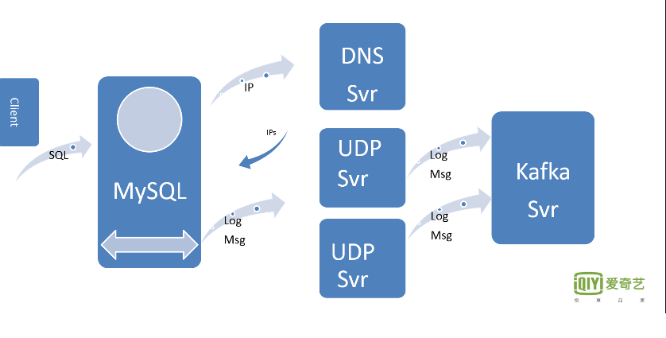

**如何安装SQL Audit&Firewall插件**

**1: 综述：**

本插件主要完成对应数据库基本操作行为的日志记录以及SQL语句的防火墙功能，在完成该插件的安装后，根据所配置的的参数，相应的对应数据库的操作行为将会被记录在data目录下的名为audit_xxx.log的
json形式的文件中。该文件中包括：操作的类型，操作者的账号，地址，端口，语句等等。下面就对该插件的安装，卸载，及相关配置进行描述。 

**2：相关文件：**

该插件公有如下几个.so文件，由于该插件是以动态库的方式运行，因此该插件以.so文件格式提供。下面是文件列表。

1：libaudit_plugin.a

2：libaudit_plugin.la

3：libaudit_plugin.so

4：libaudit_plugin.so.0 (link file)

5: libaudit_plugin.so.0.0.0(link file)

**3：安装：**

对应该插件的安装，有如下的两种方式： **（1）自动安装&运行；** **（2）手动安装。**

（0）准备工作

在该方式下，首先将该插件的**.so**文件拷贝到mysql plugin的文件夹中。用户可以通过运行 “show variables like '%plugin%';” 命令来查询当前数据库实例所所指定的plugin安装路径。

例如：

在本例子中插件的安装地址为/usr/local/mysql/lib/plugin/,因此需要将该该插件的相关文件拷贝到该目录下。在完成上述的准备工作后，我们就可以进行插件的安装工作。

（1）自动安装&运行

该种方式下，通过配置mysql的my.cnf文件来进行插件的安装及配置，为了能够让mysql识别该插件因此需要在所需要安装的mysql实例的my.cnf文件中的mysqld section添加如下的信息：

**plugin-load=AUDIT=libaudit_plugin.so**

该语句表明mysql实例在启动的时候需要加载 libaudit_plugin.so文件。而该文件正是正是插件所对应的so文件。在设置了相应所需要加载的插件后，对应audit&firewall插件来说，需要设置
一个offset参数，该参数属于插件内部所使用的一个系统参数，用来描述了插件所需要使用到的域在mysql源码中THD对象中的偏移量。 该参数可以通过offset-extract目录中的相应的脚本来获取。

**但是有一点需要注意：该脚本所需要使用的是带有debuginfo信息，和GDB，因为其会使用debuginfo来获取mysql实例中THD对象中各个域相应的偏移量。**

下面给出常用（当前运行的）版本的offset值： 

1:5.6.26版本： 6992, 7040, 4000, 4520, 72, 2704, 96, 0, 32, 104, 136, 7128, 4392, 2800, 2808, 2812, 536, 0, 0, 6360, 6384, 6368, 13048, 548, 516

同时，我们还需要配置该插件的运行模式，是否是写日志文件，还是将该日志通过UDP Server发发到kafka中。 下面就给出推荐的配置（外发kafka）.

由于在该种模式下，需要通过UDP SERVER作为中消息的relay，因此我们需要设置一个UDP SERVER的地址。为了能够支持多UDP SERVER实例运行，我们将这些实例隐藏在DNS后面，
由DNS来提供统一的访问地址。故而参数audit_dns_svr_addrr描述了该DNS的URL，audit_remote_port则描述，UDP SERVER所监听的端口。 UDP Server会根据该URL自动解析该URL
所对应的主机数量及所对应的IP地址，并将该IP地址与PORT结合，连接到该UDP 服务器上。

audit_record_cmds = SELECT,INSERT,UPDATE,DELETE,SHOW,CREATE,DROP,ALTER

audit_json_file=OFF -- 不使用文件方式

audit_json_socket=ON  --使用socket方式，提供两种方式：unix socket和upd。

audit_dns_svr_addr=auditformysql-mysql-dev001-bjdx11.qiyi.virtual --当使用udp方式时候，所需要的dns url.

audit_remote_port=5000 --udp server监听的端口。

audit_socket_type=udp  --socket的类型，两种：（1）unix；（2）udp。

audit_uninstall_plugin=ON --是否支持uninstall 命令卸载。 

audit_parsing_sql=ON

（2）手动安装方式：

1: 该种方式下，同样，需要在将插件so文件拷贝到正确的目录前提下；在完成上述操作后，登录mysql，运行如下命令：(注意AUDIT大写)

**install plugin AUDIT soname 'libaudit_plugin.so'**

在正确安装后mysql会通知DBA，插件安装成功;

2: 在安装成功后，如果想卸载该插件则可以运行如下命令：

**uninstall plugin AUDIT**

我们需要运行该命令两边以确切正确的卸载该插件。至于需要运行该命令两边的因为是：我们采用hot patch（即：trampoline function）的方式对mysqld实例中的内部系统函数进行替换。 
因此我们第一遍运行时候，需要卸载我们所安装的改写函数，第二遍则是卸载该插件。 

3：三在正确安装该插件后，我可以通过如下的命令来检查该插件是否是正确的安装：

**show variables like '%audit%'** 

或者

**select * from mysql.plugins** 

上述第一条语句会列出该插件的所有的可配置的参数；而第二条语句则会将mysql数据库中的plugins表中的所有记录列出。因为该系统表中记录了当前所安装的所有的插件信息；

如果想修改该插件的相关配置则我们可以运行如下的命令：

**set global audit_xxx_xx = xxx**

对于所需要配置的参数如my.cnf中一样，唯一不同的是通过命令方式可以进行动态配置，这样在每次mysql实例重新启动后，需要重新配置，而my.cnf方式则无需进行重新配置。 

**备注：**
对于其它的参数的含义请参照相应的说明[...](http://gitlab.qiyi.domain/database/MySQL-Audit/wikis/how-to-setup-plugin-funcs)

**4：UDP SERVER安装及配置**

由于我们的数据库操作消息均是通过UDP Server的中继，从而将该消息发送至kafka中。因此我们需要正确的安装并配置该服务器

我们推荐的部署方式是将该服务器部署在与mysql实例不同的机器上。当然也可以部署在同一台机器上。 推荐的做法是申请一些虚拟机作为该server运行平台。 并将这些server注册到一个DNS上，
将该DNS URL暴露给用户。 该服务器的相关代码可以从[Msg-Proxy](http://gitlab.qiyi.domain/database/Message-Proxy) 这里获得。

该服务器的参数较为简单，这些参数在名为 msg-proxy-svr.cnf 文件中。 其中的配置项如下：

[Msg-Proxy-Svr]

LISTENING_PORT=5000 --描述了服务器所监听的端口

[Kafka-Svr-0]

KAFKA_BROKER=mysql-kafka-dev005-bdyf.qiyi.virtual:2181,mysql-kafka-dev004-bdyf.qiyi.virtual:2181,mysql-kafka-dev003-bdyf.qiyi.virtual:2181,mysql-kafka-dev002-bdyf.qiyi.virtual:2181,mysql-kafka-dev001-bdyf.qiyi.virtual:2181 --kafka broker的地址

KAFKA_TOPIC=Audit-log-Message --消息的主题

KAFKA_PARTITION=5 --partition数量

